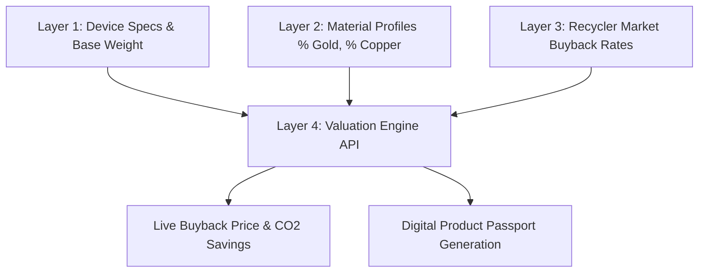

# ♻️ EcoTrace
> **AI-Powered Doorstep E-Waste Valuation, Digital Product Passport (DPP), & Circular Supply Chain Traceability Platform**

---

## 📌 Executive Overview

**EcoTrace** is an end-to-end circular economy platform designed to solve electronic waste management challenges across India. It connects individual e-waste donors, corporate organizations, CPCB-authorized smelters, recyclers, and community leaders through a transparent, AI-assisted valuation and Digital Product Passport (DPP) ecosystem.

By leveraging a 4-layer material composition dataset and real-time smelter buyback telemetry, EcoTrace calculates instant monetary valuations for legacy devices while tracking critical carbon offset metrics ($kg\ CO_2$ saved).

---

## 🌟 Key Features & Portals

### 1. 📱 E-Waste Donor Portal & Dashboard (`DonorDash.jsx`)
* **AI Device Scanner & Calculator**: Instant device recognition and value estimation based on weight and material purity.
* **CO₂ Offset Telemetry**: Live environmental impact counter tracking carbon offset and precious metals saved from landfills.
* **Doorstep Pickup Booking**: Streamlined scheduling with address validation and time-slot allocation.
* **Digital Product Passport (DPP) Viewer**: Scannable QR code and lifecycle passport generation for every recycled item.

### 2. 🏬 CPCB Authorized Recycler & Smelter Portal (`RecyclerDash.jsx`)
* **Real-time Pickup Queue**: Manage incoming e-waste requests assigned to licensed recycling facilities.
* **Depot Intake & Verification**: Verify physical device arrivals against DPP IDs.
* **Material Extraction Tracking**: Monitor recovery stats for Gold ($Au$), Copper ($Cu$), Silver ($Ag$), and Lithium ($Li$).
* **Lifecycle Status Updater**: Real-time status transitions (`Pickup Booked` ➔ `In Transit` ➔ `Smelter Processing` ➔ `Completed`).

### 3. 🏢 Organization Admin Panel (`OrganizationAdminPage.jsx`)
* **Corporate E-Waste Audits**: Manage multi-branch corporate client accounts, bulk device batches, and compliance reports.
* **Logistics & Worker Allocation**: Dispatch field workers and supervise pickup depot operations.
* **Metals Telemetry Analytics**: Aggregated analytics on precious metals yield and compliance verification.

### 4. 🌐 Community Drive Hub & Sub-Admin Panel (`CommunityAdminPage.jsx`)
* **Green Drive Organization**: Host campus and municipal e-waste collection drives.
* **Pass Generator & Event Management**: Issue digital participant passes, post announcements, and review green host proposals.

### 5. 🛡️ System Master Admin Dossier (`AdminPage.jsx`)
* **Global Datasets & Scans Matrix**: Centralized management of Layer 1 (Devices), Layer 2 (Material Profiles), and Layer 3 (Recycler Pricing).
* **System Health & Audit Logs**: Monitor DPP passport lineage and system component status.

---

## 📐 Architecture & 4-Layer Valuation Engine



1. **Layer 1 (Devices)**: Generic specifications, categories, and base weights.
2. **Layer 2 (Material Profiles)**: Composition breakdown (e.g., % Gold, % Copper, % Lithium, % Rare Earths).
3. **Layer 3 (Recycler Pricing)**: Live market rates set by CPCB-authorized smelters.
4. **Layer 4 (Valuation Engine)**: Node.js Express service computing real-time valuations and carbon savings.

---

## 🛠️ Technology Stack

* **Frontend**: React 18, Vite, Lucide React Icons, Vanilla CSS Design System, Responsive Glassmorphism Architecture.
* **Backend**: Node.js, Express.js, Zod Schema Validation, CORS.
* **Database & Services**: Firebase / Firestore, Supabase Client Utilities.
* **Documentation & Data**: OpenApi 3.0 specification (`openapi.yaml`), CPCB material composition datasets.

---

## 🚀 Getting Started

### Prerequisites
* **Node.js** (v18 or higher)
* **npm** (v9 or higher)

---

### 1. Frontend Setup

```bash
# Navigate to frontend directory
cd frontend

# Install dependencies
npm install

# Run Vite development server
npm run dev
```
The frontend app will launch at `http://localhost:5173`.

---

### 2. Backend Setup

```bash
# Navigate to backend directory
cd backend

# Install dependencies
npm install

# Create environment file
cp .env.example .env

# Run Express backend server
npm run dev
```
The API server will launch at `http://localhost:3000`.

---

## 🔌 API Endpoints Reference

| HTTP Method | Endpoint | Description |
| :--- | :--- | :--- |
| `GET` | `/health` | Server health check |
| `POST` | `/api/valuations/calculate` | Calculate real-time device valuation & CO₂ saved |
| `POST` | `/api/passport` | Generate a new Digital Product Passport (DPP) |
| `POST` | `/api/pickup` | Schedule a doorstep e-waste pickup request |
| `GET` | `/api/recycler/requests` | Fetch pending requests assigned to a recycler |
| `PATCH` | `/api/traceability/status` | Update lifecycle status of a DPP item |

---

## 📂 Repository Structure

```text
EcoTrace/
├── backend/                  # Node.js + Express REST API Server
│   ├── src/
│   │   ├── controllers/      # Route controllers (Valuation, Passport, Pickup, etc.)
│   │   ├── services/         # 4-Layer Valuation Engine & Firestore services
│   │   ├── routes/           # Express routes
│   │   └── config/           # Firebase initialization
│   ├── scripts/              # Database seed scripts
│   └── openapi.yaml          # OpenAPI specification
├── frontend/                 # React SPA (Vite)
│   ├── src/
│   │   ├── components/       # Reusable UI components & modal dialogs
│   │   ├── pages/            # 12+ Role-based views & Dashboards
│   │   ├── services/         # API integration layer
│   │   └── styles/           # Global CSS tokens & themes
│   └── public/               # Public media, icons, and video assets
├── WORK GUID/                # Comprehensive integration guides & developer documentation
├── Founders/                 # Leadership team documentation & assets
└── vercel.json               # Deployment routing configuration
```

---

## 👥 Contributors & Leadership

* **Rahul Kushwaha** (`Dominus005era`)
* **Tanay Singh** (`Tanay-3137`)
* **Ashmit Verma**
* **Ayush Yadav**
* **Md. Umar Zahid**
* **Rishika Singh**

---

## 📄 License

Distributed under the MIT License. See `LICENSE` for more information.
