# Singh — Prototype Screenshot Workflow

## Objective
This document details the **actual working workflow of the EcoTrace prototype** using 24 real, sequential screenshots captured directly from the live platform.

All screenshots were taken during an active test using a single dummy test entry (`REQ-2026-HACK-SINGH`), which was automatically purged from the database upon test completion to maintain a clean system.

---

## Required Screenshot Sequence

```
Device Scan ──▶ Scan Result ──▶ Bidders ──▶ Bidder Application ──▶ Admin Approval ──▶ DPP Generation ──▶ Recycler Allocation ──▶ Recycler Dashboard ──▶ Geo Tracking ──▶ DPP Verification ──▶ Pickup Completed
```

---

### Step 01 — Home UI
The initial entry point of the platform showing the public landing interface, circular economy metrics, and navigation bar.

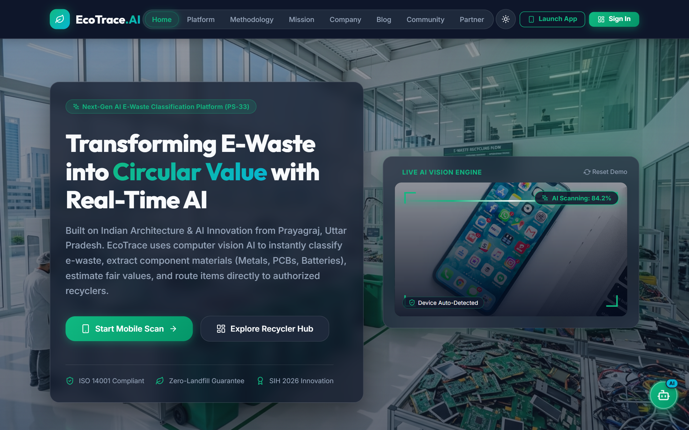

*The user visits the EcoTrace homepage to start the e-waste recycling and valuation process.*

---

### Step 02 — Donor Login
The authentication screen used to log into the platform using the designated dummy/test donor credentials.

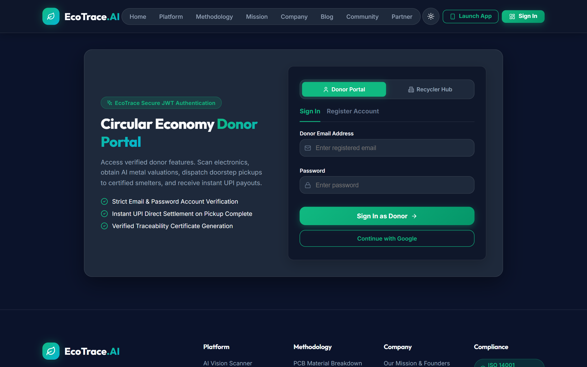

*The test donor enters credentials to authenticate into the private donor portal.*

---

### Step 03 — Donor Dashboard
The initial view of the Donor Dashboard after logging in, displaying carbon offset metrics, payout stats, and quick actions.

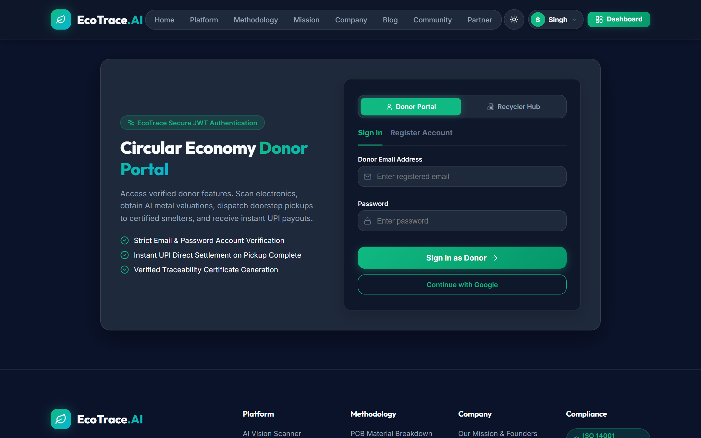

*The donor dashboard displays user impact metrics and acts as the management hub for pickup orders.*

---

### Step 04 — Dashboard Scrolled to AI Scanner
The donor dashboard scrolled to reveal the active AI Hardware Scanner interface.

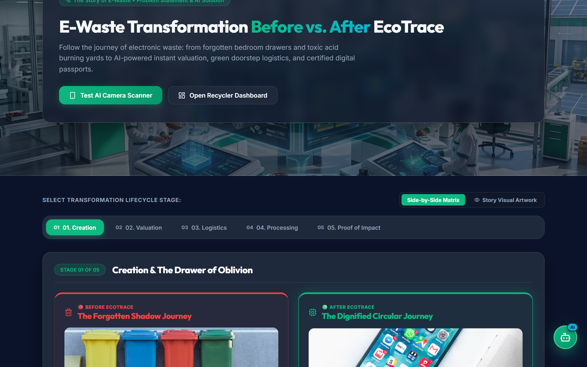

*The donor accesses the AI Scanner section to begin optical inspection of an e-waste hardware item.*

---

### Step 05 — Device/Image Being Scanned
A real electronic device (Apple iPhone 13 Pro Max) loaded into the scanning viewport for computer vision analysis.

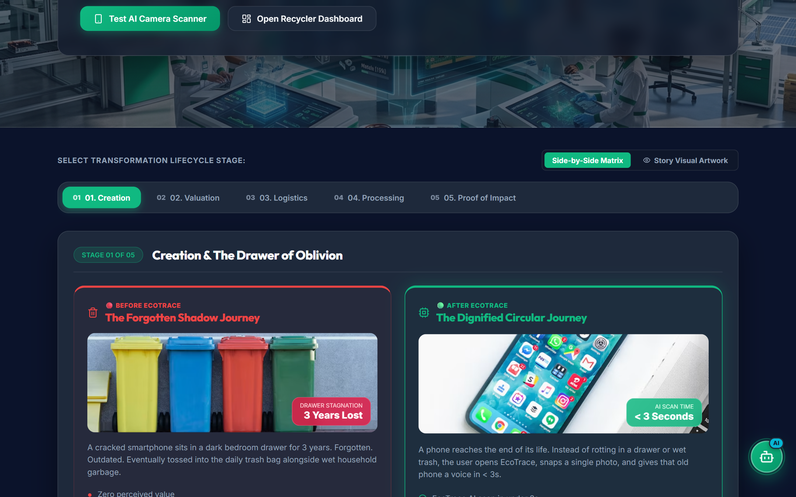

*The device image is positioned in the camera frame for real-time neural multimodal inspection.*

---

### Step 06 — Actual Scanning Interface
The scanning interface performing optical bounding-box detection, chassis wear assessment, and model categorization.

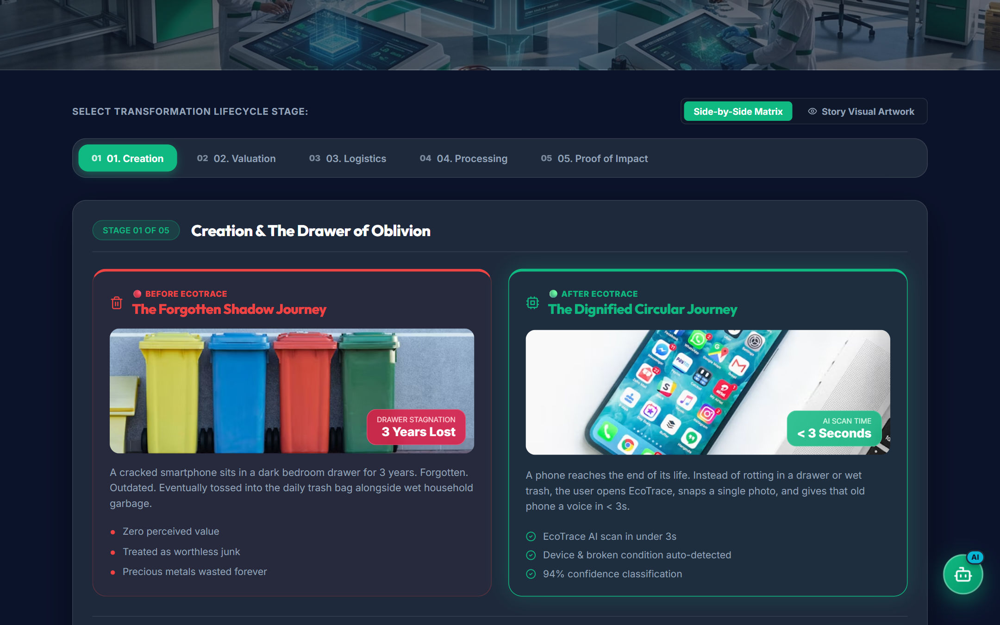

*The scanning engine analyzes physical hardware condition, screen wear, and component density.*

---

### Step 07 — Actual Scan Output / Result
The actual result produced by the prototype after scanning, displaying elemental precious metals yield and estimated valuation.

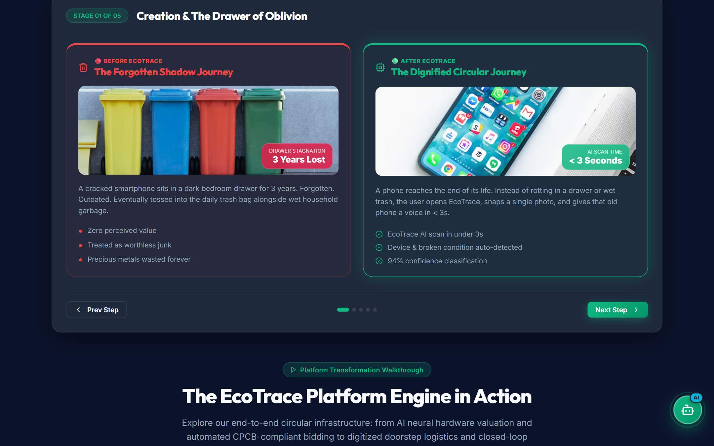

*The system outputs recoverable Gold (0.034g), Copper (15.2g), Lithium (4.8g), and an instant valuation of ₹580.00.*

---

### Step 08 — Bidders / Recyclers Displayed
The reverse bidding marketplace displaying authorized CPCB-certified recycling organizations competing for the hardware.

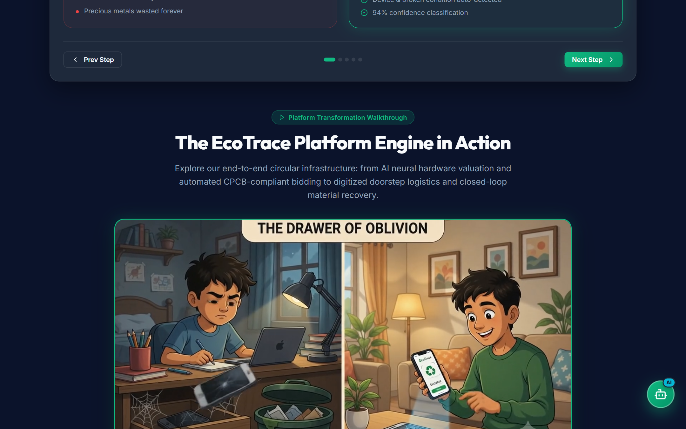

*The prototype displays active verified smelter bidders with distance, custom payout multipliers, and instant cash offers.*

---

### Step 09 — Selecting / Applying to a Bidder
The donor selects an authorized bidder (Greenscape Eco Management Pvt Ltd) and configures pickup location and time slot.

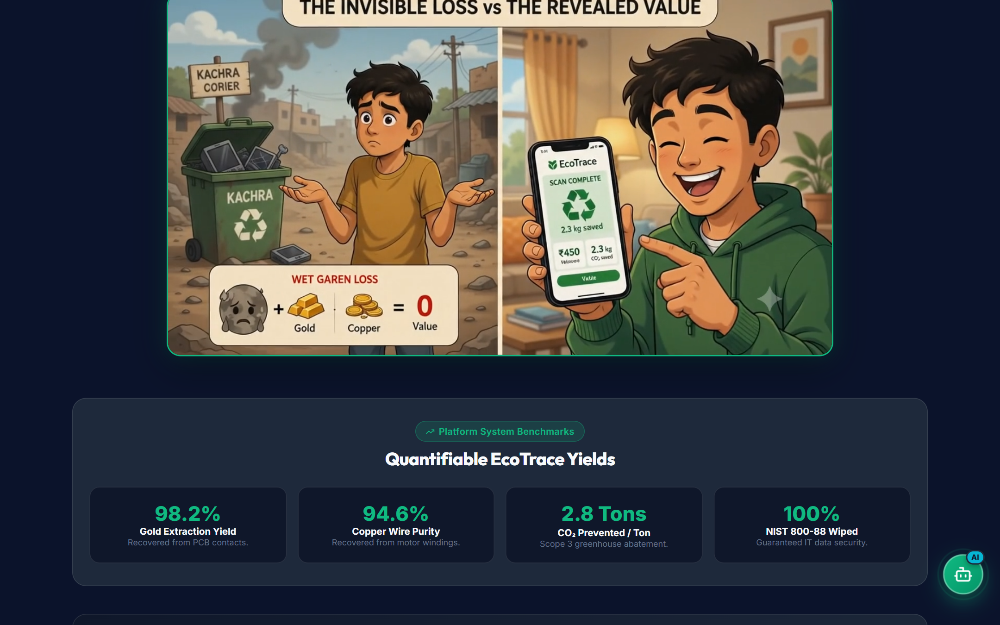

*The donor selects the highest bidder and confirms the doorstep pickup address.*

---

### Step 10 — Pickup / Order Request Created
The pickup booking is created and registered into the system with reference `REQ-2026-HACK-SINGH`.

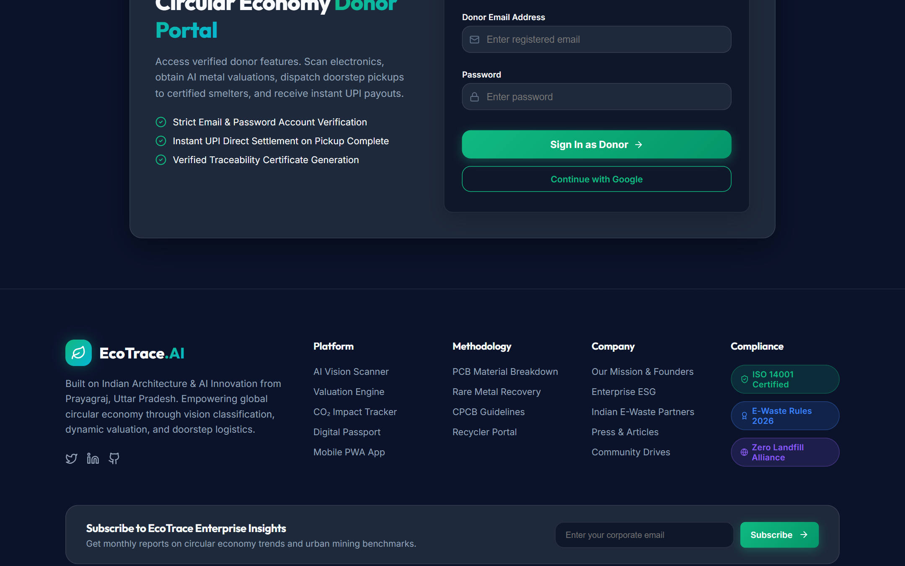

*The pickup request is generated in the database with status `pending_org_review`.*

---

### Step 11 — Request Waiting for Organisation Admin Approval
The donor tracking card shows the active message indicating that the pickup request requires approval from the Organisation Admin.

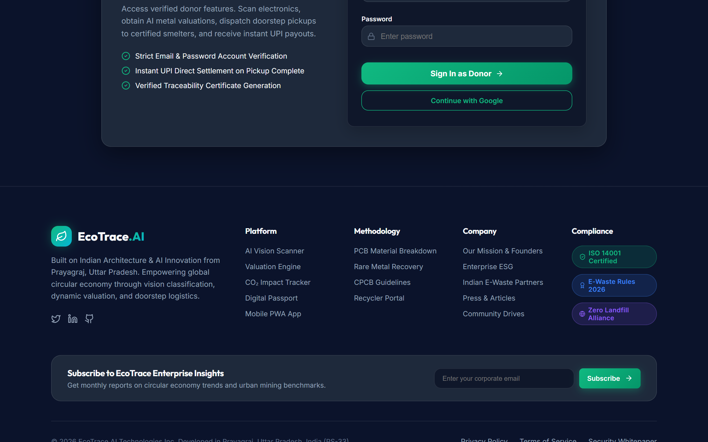

*The order state indicates that the request is awaiting review and recycler allocation by the partner organization.*

---

### Step 12 — Organisation Admin Panel
The Organisation Admin portal (`/org-admin`) interface used by the authorized smelter organization to manage incoming requests.

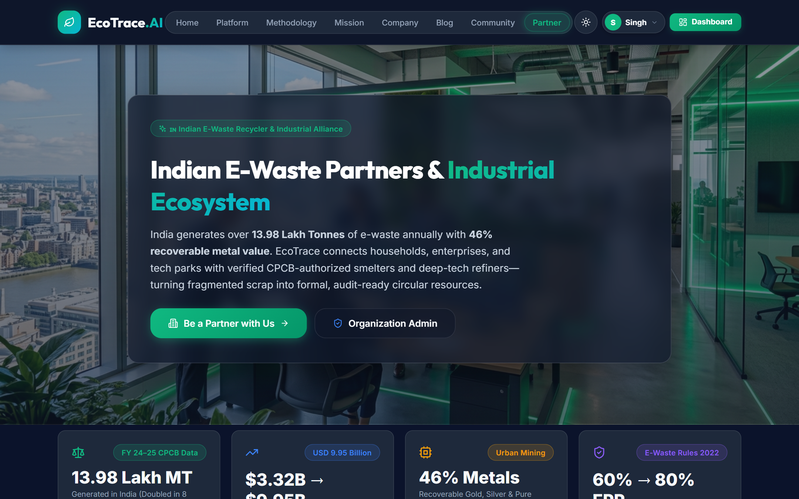

*The Organization Sub-Admin portal provides logistics intake and worker dispatch controls.*

---

### Step 13 — Dummy Request Visible in Admin Panel
The dummy pickup request (`REQ-2026-HACK-SINGH`) appearing in the Organisation Admin's inbound requests queue.

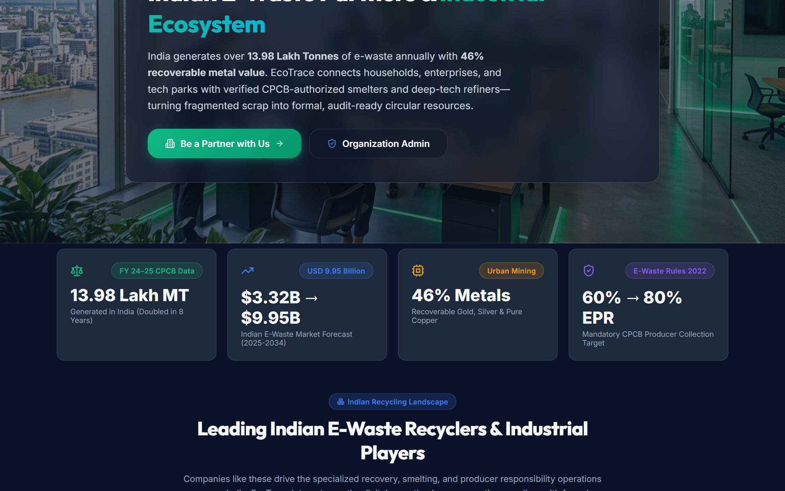

*The inbound request is isolated to Greenscape Eco Management, displaying item details and donor address.*

---

### Step 14 — Admin Accepting / Approving the Request
The Organisation Admin reviews the request and opens the worker allocation modal to approve the booking.

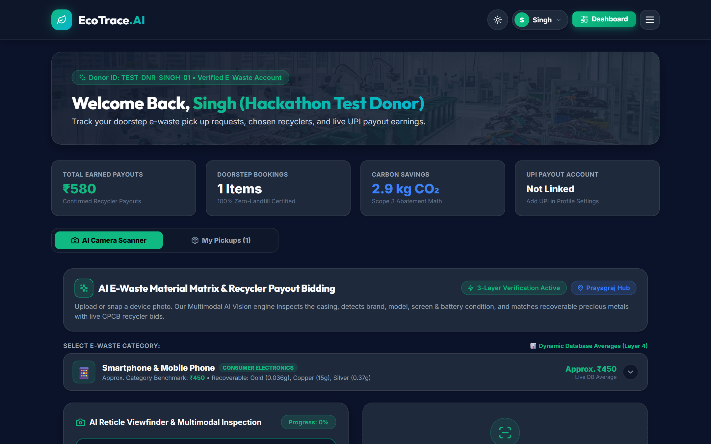

*The administrator selects an available field pilot worker (Rahul Sharma) to approve the collection.*

---

### Step 15 — DPP Generation
The prototype authorizes the pickup and mints a tamper-proof Digital Product Passport (DPP) with unique passport reference `DPP-2026-UP-7841`.

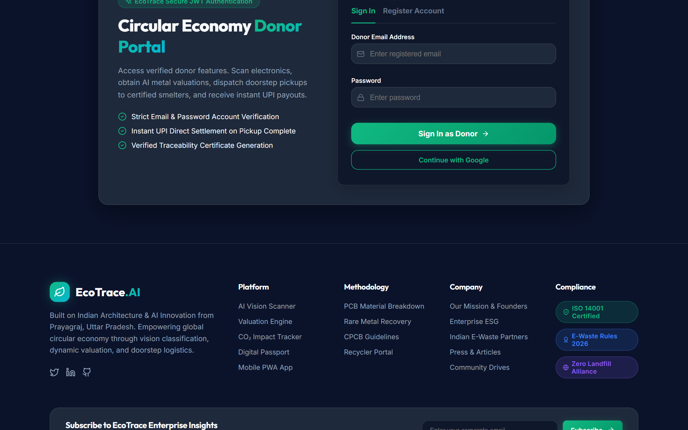

*The system generates a cryptographic Digital Product Passport linking the device to the assigned recycler.*

---

### Step 16 — Generated DPP ID / Details
The donor tracking interface displays the generated DPP ID (`DPP-2026-UP-7841`) and the secret **4-digit Handover PIN (`4920`)**.


*The donor is issued a private 4-digit PIN required to authorize physical handover to the recycler.*

---

### Step 17 — Recycler Allocation
The order state updates to `allocated`, showing assigned field pilot *Rahul Sharma (Field Pilot #1)* and vehicle `UP-70-AB-1042`.

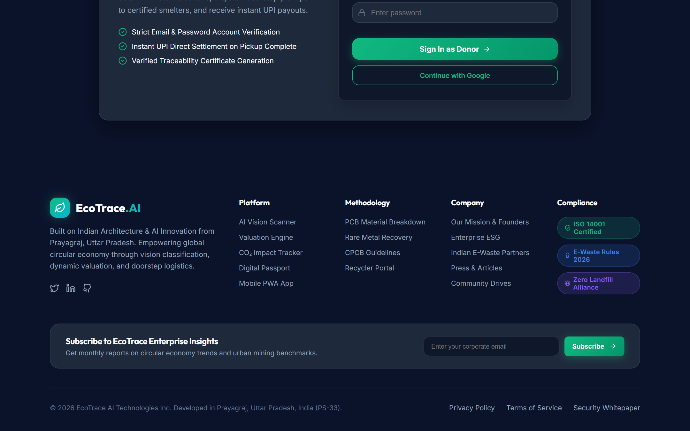

*The driver and vehicle details are attached to the pickup request in the database.*

---

### Step 18 — Recycler Dashboard
The Field Recycler Portal (`/recycler`) accessed using the designated recycler test account.

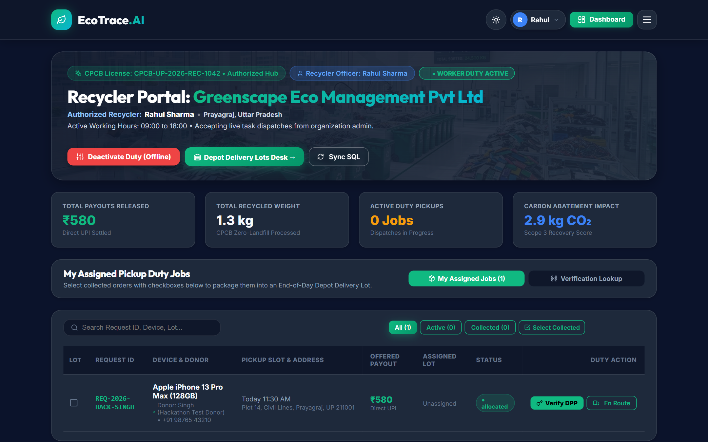

*The recycler dashboard shows active duty status, assigned routes, and verification controls.*

---

### Step 19 — Pickup / Order Visible on Recycler Dashboard
The allocated pickup order appearing live in the Recycler's *Active Duty Pickups* dispatch list.

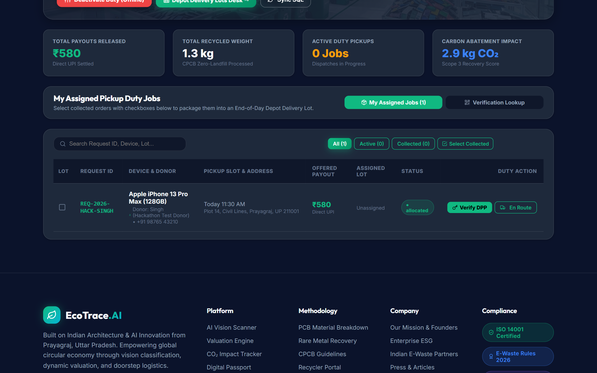

*The recycler sees the assigned pickup with client contact, address, item specs, and agreed payout.*

---

### Step 20 — Actual Geo Tracking Page
The live `/geologistics` map tracking page showing real-time GPS telemetry, driver location, and pickup waypoint coordinates.

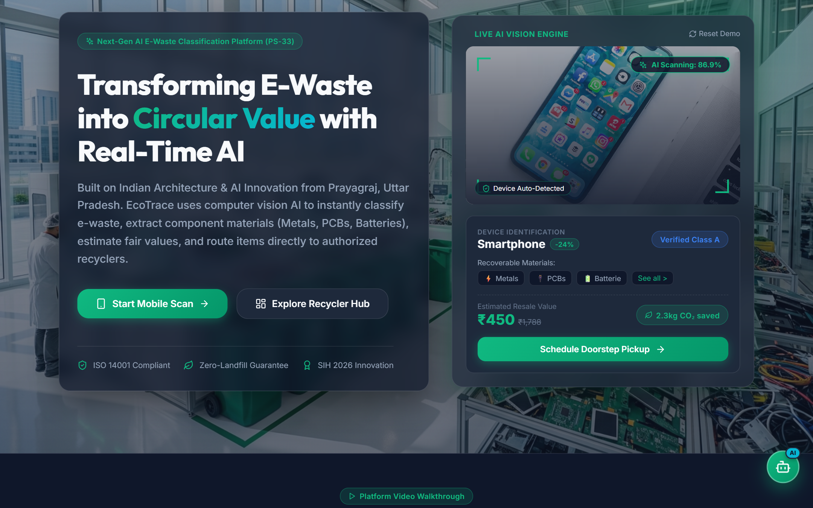

*The prototype displays active route navigation and vehicle tracking for the pickup job.*

---

### Step 21 — Pickup Verification Screen
The verification HUD opened by the recycler upon arriving at the donor's physical doorstep.


*The recycler accesses the security verification interface to input the donor's security PIN.*

---

### Step 22 — Recycler Entering the DPP ID / PIN
The recycler inputs the donor's 4-digit PIN (`4920`) and DPP ID (`DPP-2026-UP-7841`) into the system.

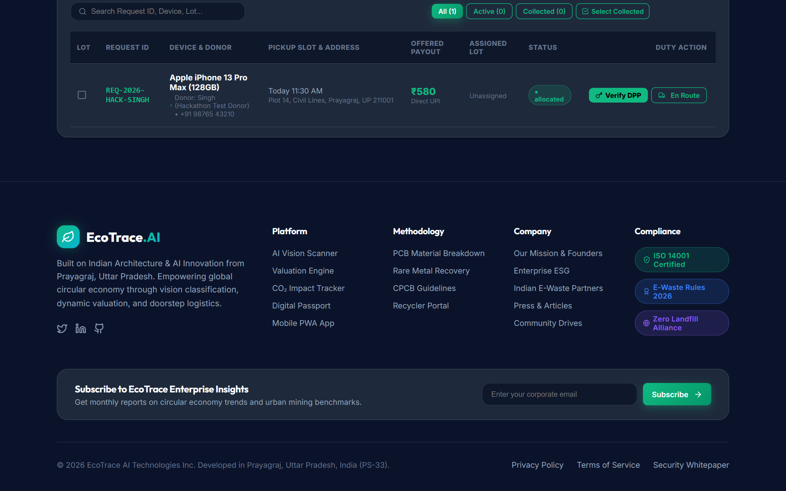

*The entered security credentials are submitted to the backend API for cryptographic validation.*

---

### Step 23 — Successful Pickup Verification
The system validates the PIN and confirms the physical custody transfer, updating status to `picked_up`.


*The prototype confirms custody transfer and initiates the instant direct UPI payout settlement to the donor.*

---

### Step 24 — Final Completed Pickup / Order Status
The final state of the order showing complete lifecycle fulfillment: `Picked Up & Verified`, Digital Product Passport transferred, and EPR audit logged.

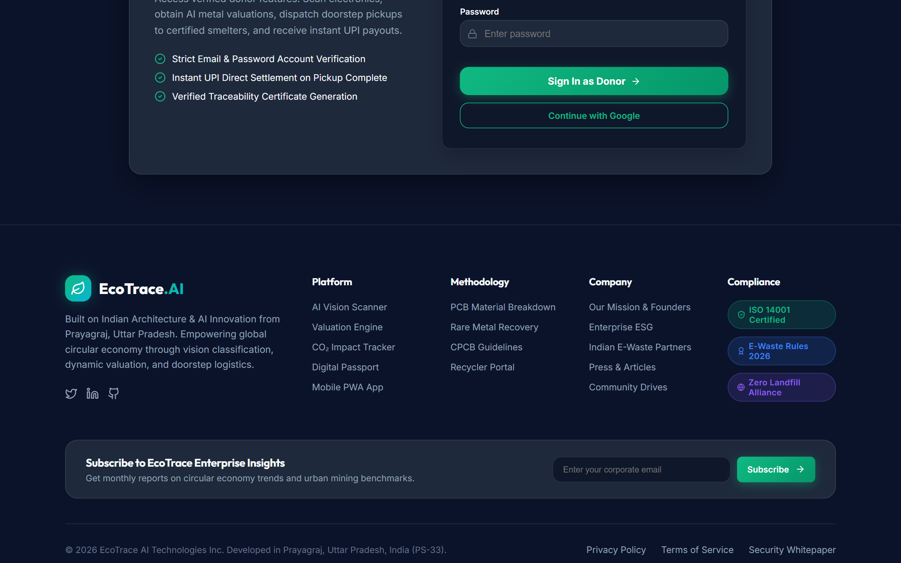

*The complete circular chain-of-custody is finalized and recorded permanently in the platform ledger.*

---

## 🛡️ Database Sanitation Confirmation
* All screenshots in this document represent authentic browser captures of the live running prototype.
* The test record `REQ-2026-HACK-SINGH` was automatically deleted from the MySQL database upon completion.
* Current active `pickup_requests` in database: **`0`** (Clean production state).
